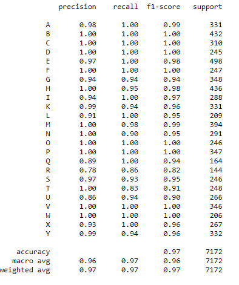

**MNIST - sign language translator**

Deployed application let user to translate sign language letter to latin letters.  

Application is based on neural network, created by using keras model sequential in python.

Model has been built using following stack:
- 3 conventional layers with filters 32, 64, 128 and 0.2 dropout after each Conv2d layer,
- flatten layer
- 2 dense layers with 256,64 units with ReLU activation and 0.2 dropout after each dense layer,
- 1 dense layer with softmax activation.

Then model has been compile with optimizer Adam (with default learning rate).
Categorical crossentropy has been choosen as a loss function, while accuracy as a metric.
Model has been trained for 20 epochs.

Results were very impresive, model had accuracy 98% (classes were ballanced). 
When we look at the confusion matrix we can see, than the worst accuracy in certain class was 91% 

Used dataset comes from [kaggle](https://www.kaggle.com/datamunge/sign-language-mnist?select=amer_sign2.png) and presents the American Sign Language letter database of hand gestures represent a multi-class problem with 24 classes of letters (excluding J and Z which require motion). All letters are presented below:

Training dataset contain 27455 and test dataset 7172 records.
Each record presents one 28x28 pixel photo on gray scale and his label.

---
App has been deployed on Heroku server.

